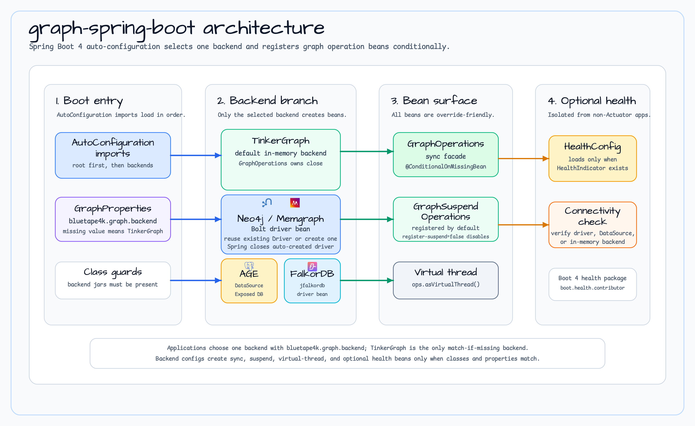

# graph-spring-boot

English | [한국어](README.ko.md)

Spring Boot 4 auto-configuration integration for [bluetape4k-graph](../../README.md).

Registers `GraphOperations`, `GraphSuspendOperations`, and `GraphVirtualThreadOperations` beans
for the selected backend via a single property.

> **Spring Boot 4 note:** This module targets Spring Boot 4.x. Spring Boot 3.x support has been removed.

## Architecture



`graph-spring-boot` uses Spring Boot auto-configuration conditions to activate exactly one graph backend:

- `GraphAutoConfiguration` loads shared `GraphProperties` and orders backend-specific auto-configurations.
- `bluetape4k.graph.backend` selects the backend; when the value is absent, only TinkerGraph matches by default.
- Backend auto-configurations are guarded by both backend property values and required runtime classes.
- Each backend registers `GraphOperations`, optional `GraphSuspendOperations`, and optional `GraphVirtualThreadOperations` with `@ConditionalOnMissingBean`.
- AGE reuses a single Spring `DataSource` and connects Exposed before creating AGE operations.
- Health indicators load only when Spring Boot 4 health classes are on the classpath.

## Supported Backends

| Backend | Property value | Required runtime dependency |
|---------|---------------|-----------------------------|
| TinkerGraph (in-memory, default) | `tinkergraph` | `graph-tinkerpop` |
| Neo4j | `neo4j` | `graph-neo4j` |
| Memgraph | `memgraph` | `graph-memgraph` |
| Apache AGE (PostgreSQL) | `age` | `graph-age` |
| FalkorDB (Redis module) | `falkordb` | `graph-falkordb` |

## Getting Started

### 1. Add dependency

```kotlin
// build.gradle.kts
dependencies {
    implementation("io.github.bluetape4k.graph:bluetape4k-graph-spring-boot:<version>")

    // Add ONE backend at runtime
    runtimeOnly("io.github.bluetape4k.graph:bluetape4k-graph-neo4j:<version>")   // or graph-memgraph / graph-age / graph-tinkerpop
}
```

For opt-in graph-io progress metrics, add the bridge and Micrometer registry
provided by your application:

```kotlin
dependencies {
    implementation("io.github.bluetape4k.graph:bluetape4k-graph-io-micrometer:<version>")
    implementation("org.springframework.boot:spring-boot-starter-actuator")
}
```

### 2. Configure `application.yml`

**TinkerGraph (in-memory — no extra config needed):**
```yaml
bluetape4k:
  graph:
    backend: tinkergraph
    io:
      metrics:
        enabled: true
```

When enabled and a `MeterRegistry` is present, auto-configuration registers the
concrete `graphIoMicrometerProgressListener` bean. It is intentionally not an
unqualified `GraphIoProgressListener` autowire candidate; look it up by name
and compose it explicitly with an application listener.

```kotlin
@Resource(name = "graphIoMicrometerProgressListener")
lateinit var metricsListener: GraphIoProgressListener

val listener = GraphIoCompositeProgressListener.of(userListener, metricsListener)
importer.importGraph(source, ops, options, listener)
```

**Neo4j:**
```yaml
bluetape4k:
  graph:
    backend: neo4j
    neo4j:
      uri: bolt://localhost:7687
      username: neo4j
      password: secret
      database: neo4j
      register-suspend: true
      register-virtual-thread: true
```

**Memgraph:**
```yaml
bluetape4k:
  graph:
    backend: memgraph
    memgraph:
      uri: bolt://localhost:7687
      username: ""
      password: ""
      database: memgraph
      register-suspend: true
      register-virtual-thread: true
```

**Apache AGE (PostgreSQL):**
```yaml
bluetape4k:
  graph:
    backend: age
    age:
      graph-name: my_graph
      auto-create-graph: true
      register-suspend: true
      register-virtual-thread: true
```

> AGE requires a JDBC `DataSource` bean. Add `spring-boot-jdbc` to your dependencies.

**FalkorDB (Redis-based graph database):**
```yaml
bluetape4k:
  graph:
    backend: falkordb
    falkordb:
      host: localhost
      port: 6379
      username: ""        # leave blank for unauthenticated access
      password: ""
      graph-name: my_graph
      register-suspend: true
      register-virtual-thread: true
```

### 3. Inject and use

```kotlin
@Service
class MyGraphService(
    private val ops: GraphOperations,
    private val suspendOps: GraphSuspendOperations,   // optional
) {
    fun createPerson(name: String): GraphVertex =
        ops.createVertex("Person", mapOf("name" to name))

    suspend fun findPerson(id: GraphElementId): GraphVertex? =
        suspendOps.findVertexById("Person", id)
}
```

## Registered Beans

| Bean type | Condition |
|-----------|-----------|
| `GraphOperations` | Always when backend is active |
| `GraphSuspendOperations` | `register-suspend=true` (default) |
| `GraphVirtualThreadOperations` | `register-virtual-thread=true` (default) |
| `HealthIndicator` (Neo4j/Memgraph/AGE/TinkerGraph/FalkorDB) | When `spring-boot-health` is on classpath |

All beans use `@ConditionalOnMissingBean` — provide your own bean to override.

TinkerGraph's auto-configured `GraphSuspendOperations` has one additional
guard: it is created only when the active `GraphOperations` bean is a
`TinkerGraphOperations`. Supplying another `GraphOperations` implementation
backs off the TinkerGraph suspend factory instead of failing application
startup. Provide both `GraphOperations` and `GraphSuspendOperations` when a
custom synchronous implementation also needs a suspend API. Setting
`bluetape4k.graph.tinkergraph.register-suspend=false` explicitly disables the
auto-configured suspend bean; the virtual-thread adapter can still wrap any
active `GraphOperations` bean.

Neo4j and Memgraph keep backend identity through the named driver beans
`neo4jDriver` and `memgraphDriver`. Their operations, suspend operations, and
health indicators inject the matching name with `@Qualifier`; an unrelated or
additional Neo4j-compatible `Driver` bean therefore neither suppresses the
backend driver nor creates an ambiguous injection. Provide an explicit bean
with the matching name to override the default.

## Configuration Properties

### Common

| Property | Default | Description |
|----------|---------|-------------|
| `bluetape4k.graph.backend` | *(none — TinkerGraph activates by default)* | Active backend: `tinkergraph` \| `neo4j` \| `memgraph` \| `age` \| `falkordb` |

### Neo4j (`bluetape4k.graph.neo4j.*`)

| Property | Default | Description |
|----------|---------|-------------|
| `uri` | `bolt://localhost:7687` | Bolt URI |
| `username` | `neo4j` | Username |
| `password` | *(empty)* | Password (empty → no-auth) |
| `database` | `neo4j` | Target database |
| `register-suspend` | `true` | Register `GraphSuspendOperations` |
| `register-virtual-thread` | `true` | Register `GraphVirtualThreadOperations` |

### Memgraph (`bluetape4k.graph.memgraph.*`)

Same properties as Neo4j with prefix `bluetape4k.graph.memgraph`. Default database: `memgraph`, default username: *(empty)*.

### Apache AGE (`bluetape4k.graph.age.*`)

| Property | Default | Description |
|----------|---------|-------------|
| `graph-name` | `bluetape4k_graph` | AGE graph name |
| `auto-create-graph` | `true` | Create graph if not exists |
| `register-suspend` | `true` | Register `GraphSuspendOperations` |
| `register-virtual-thread` | `true` | Register `GraphVirtualThreadOperations` |

### FalkorDB (`bluetape4k.graph.falkordb.*`)

| Property | Default | Description |
|----------|---------|-------------|
| `host` | `localhost` | FalkorDB host address |
| `port` | `6379` | FalkorDB Redis port |
| `username` | *(empty)* | Authentication username (blank = no-auth) |
| `password` | *(empty)* | Authentication password (blank = no-auth) |
| `graph-name` | `bluetape4k` | Target graph name |
| `register-suspend` | `true` | Register `GraphSuspendOperations` |
| `register-virtual-thread` | `true` | Register `GraphVirtualThreadOperations` |

## Auto-Configuration Classes

| Class | Activated when |
|-------|---------------|
| `GraphAutoConfiguration` | Always — loads `GraphProperties`, establishes ordering |
| `GraphTinkerGraphAutoConfiguration` | `backend=tinkergraph` or property absent |
| `GraphNeo4jAutoConfiguration` | `backend=neo4j` |
| `GraphMemgraphAutoConfiguration` | `backend=memgraph` |
| `GraphAgeAutoConfiguration` | `backend=age` |
| `GraphFalkorDBAutoConfiguration` | `backend=falkordb` |
| `GraphIoMicrometerAutoConfiguration` | `bluetape4k.graph.io.metrics.enabled=true`, bridge + `MeterRegistry` present |

## Spring Boot 4 Notes

Spring Boot 4 splits several previously bundled modules. Add them explicitly if needed:

| Artifact | When needed |
|----------|-------------|
| `spring-boot-health` | `HealthIndicator` support (`org.springframework.boot.health.contributor`) |
| `spring-boot-jdbc` | JDBC/DataSource auto-configuration (required for AGE backend) |
| `spring-boot-restclient` | `RestClient` / `RestTemplate` |
| `spring-boot-resttestclient` | `TestRestTemplate` in tests |
| `spring-boot-webtestclient` | `WebTestClient` in tests |

The `HealthIndicator` package also changed:
- Boot 3: `org.springframework.boot.actuate.health.HealthIndicator`
- Boot 4: `org.springframework.boot.health.contributor.HealthIndicator`
